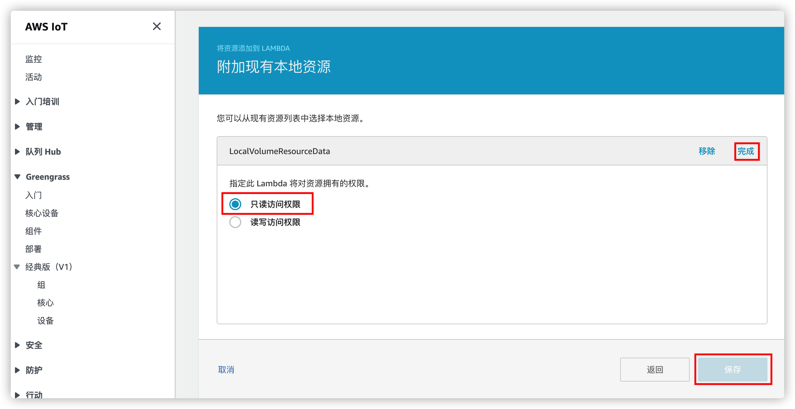

# IoT-message-generator
## 说明
该代码主要用于IoT 消息的生成转换和展示,支持使用Cloudformation 一键部署.
## 背景
1. AWS IoT Greengrass 的安装过程复杂,通常需要30分钟以上时间配置,此脚本可以在数分钟内自动在EC2上生成证书并部署Greengrass 软件.
2. 现有IoT 设备模拟程序通常需要手动修改程序代码或Json文件用于生成IoT数据,为了更加方便数据生成,此代码直接读取现有CSV文件(可以存放于S3上),从CSV文件第一行取得Key,顺序从第二行开始取得value,并发送消息,这样可以灵活定制IoT 数据.
3. IoT 数据的展现通常使用Sitewise/QuickSight或第三方形式,此脚本通过一个lambda将IoT 数据打入到Cloudwatch中展示,无需配置,只需要修改Lambda环境变量即可修改需要展示的数据.
## 代码说明
1. CopyFilesToS3 代码段的Lambda 可以用于Cloudformation 运行后复制数据(Cloudformation 默认是不允许在执行过程中复制数据)
2. GreengrassGroup代码段为配置Greengrass 相关权限和安装配置Greengrass,其中 IoT2S3Lambda部分可以用于IoT到S3数据的装换(使用Kinesis)
3. IoT2CWLambda 代码段用于 IoT 数据发送到Cloudwatch 创建的命名空间进行展示,可以通过修改环境变量更换展示的数据
4. GreengrassInstance 代码段用于自动创VPC,子网,安全组,下载Greengrass 软件到Instance 并下载证书安装软件
## 部署方法
1. 上传Message_generator.yml 到AWS Cloudformation 平台或点击[创建](https://us-east-1.console.aws.amazon.com/cloudformation/home?region=us-east-1#/stacks/quickcreate?templateURL=https://pdm-workshop-ue1.s3.amazonaws.com/cfn/e2eworkshop_final.yml&stackName=e2eWorkshop),创建过程中需要指定名称,VPC,地址,Keypair等.
2. 创建完成后,待EC2 启动完成,拷贝需要的生成消息的CSV文件到 EC2的/shared/greengrass/buffer/ 目录下即可
3. 将Greengrass Lambda 挂载本地资源,选择LocalVolumeResourceData资源,选择只读访问权限.
     
4. 在AWS IoT Core 测试界面找到测试,订阅 "sensor/out" 即可,这个topic可以做相应修改.

## 使用限制
1. 目前可以在以下区域使用,us-east-1,us-west-2,eu-west-1,eu-central-1,ap-northeast-1,ap-southeast-1,ap-southeast-2,其他区域自行复制AMI 解决
2. CSV 文件无需Header,以","分割
3. 文件可以手动拷贝,也可以自行修改Userdata 完成自动复制,例如在

```
sudo chown -R ggc_user:ggc_group /shared/greengrass/buffer
```
下方增加

```
sudo wget -cO - https://Someurl//iotdata.csv >/shared/greengrass/buffer/iotdata.csv 
```
## 代码说明
代码自动完成以下工作
1. 创建VPC资源,包括子网,安全组
2. 创建虚拟机并安装Greengrass软件,启用服务
3. 创建Lambda及相应组件,包括资源组,证书策略等
